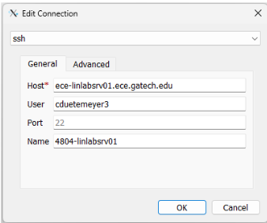
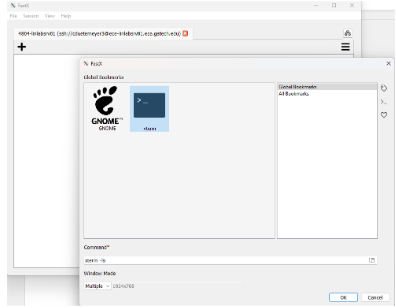
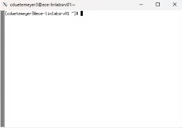
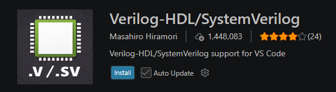
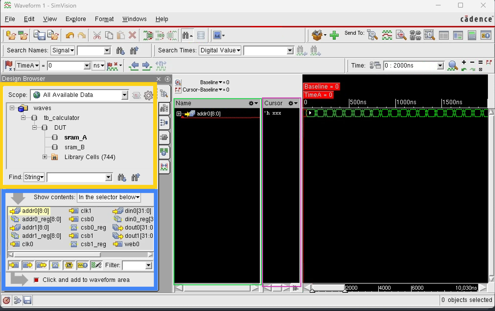

# Digital Design Onboarding F26

Build a small RV32I-style processor around the provided top level, SRAMs, and
testbench. The goal is to get a working single-core CPU that can fetch
instructions from instruction SRAM, execute them, read/write data SRAM, and
halt cleanly when it reaches `ebreak`.

Some parts of this processor have been implemented for you as a starting point. 

This project is intentionally open-ended on microarchitecture, but the baseline
design should be at least 2 cycles because the SRAM read interface takes more
than one cycle. Pipelining is allowed, but is not
required.

## Assignment

Implement the CPU in `src/verilog/cpu/`. Your design should connect through
the existing `cpu_top.sv` interface and use the provided memory/controller
structure in `src/verilog/`.

Requirements:

- `addi` with a positive immediate: add immediate
- `addi` with a negative immediate: subtract immediate
- `add`: register-register add
- `sub`: register-register subtract
- `lw`: load word from data SRAM using an immediate offset
- `sw`: store word to data SRAM using an immediate offset
- `beq` against `x0`: branch if zero
- `sll`: left logical shift
- `srl`: right logical shift
- `ebreak`: halt the CPU
- Register `x0` must stay zero, and data memory word `data[0]` should remain
  `0x00000000`

## Provided Files

- `src/verilog/chip_top.sv`: instantiates the CPU, SRAMs, and memory controller
- `src/verilog/memory_controller.sv`: arbitrates between external testbench
  access and CPU access to SRAM/register state
- `src/verilog/sram_wrapper.sv`: wraps the provided SRAM macro
- `src/verilog/CF_SRAM_1024x32.tt_180V_25C.v`: provided 1024x32 SRAM macro
- `src/verilog/tb_processor.svp`: main processor testbench
- `src/verilog/cpu/cpu_top.sv`: CPU integration point
- `src/verilog/cpu/fetch.sv`: instruction fetch scaffold
- `src/verilog/cpu/reg_file.sv`: register file wrapper

---

## Getting Started

1. Sign the EULA agreement for Cadence tools (https://eulas.ece.gatech.edu/Cadence/)
    - Under Primary GT Affiliation -> Select "Researcher or Staff"
    - Your Title: "Student"
    - ECE Faculty Advisor / Professor Name : "Visvesh S Sathe"
    - ECE Faculty Advisor / Professor Email: "sathe@gatech.edu"
    - Software needed for -> "Research"
    - Research Project Name : "SiliconJackets"
    - Agree to Cadence agreement
2. Download Georgia Tech VPN (https://vpn.gatech.edu/global-protect/getsoftwarepage.esp)
3. Log into the GlobalProtect VPN once downloaded(portal: vpn.gatech.edu)  
    - use your school username and password
    - 'push1' sends a push to DUO, 'phone1' gives you an automated phone call
4. Download FastX or MobaXterm (or your preferred remote Terminal Emulator)
    - FastX (https://www.starnet.com/download-fastx-client/)
    - MobaXterm (https://mobaxterm.mobatek.net/download-home-edition.html)
5. Log in remotely to ECE Research server
    - The setup will be similar but different depending on the terminal emulator you choose
    - The following instructions work for FastX, but ask if you need help setting up with MobaXterm
    - Ensure you are connected to GT VPN
    - Open FastX Client
    - File->Connections. Click the plus sign to add a connection.
    - Host:  ece-rschsrv.ece.gatech.edu
    - Username: <your_GT_username>
    - Port: 22
    - Name: Whatever you want to call the connection
    - Here is an example of what your screen should look like:
    - 
    - Connect to the session and type in your GT password at the prompt
    - Click the plus sign and then "xterm"
    - 
    - You should now be remotely connected to the Research server Linux terminal 
    - 
  
6. run the tcsh command to switch to c-shell. This command needs to be __run every time__ you log into the server. (You should see a '>' and NOT a '$')
7. IMPORTANT: Add the following line to your ~/.my-cshrc file: 'source /tools/software/cadence/setup.csh'. This will allow you to run the commands for cadence tools if you have gotten your EULA approved. (your ~/.my-cshrc file might be empty up until now, so just make this the first line). This is how you can do this: return to your home directory by running "cd ~". Then, do "nano ~/.my-cshrc" to enter the config file. Copy the line provided into it, then hit ctrl + the letter "o", then hit enter to save. Then hit ctrl + x to quit. To apply the changes, type "source ~/.my-cshrc". Now, typing xrun should not show an error. 
8. Clone this repo into the linux server. This is done using git clone url <--replace url with github-provided url. You might be prompted to input your username and password for git. 
9.  At this point, you can write your code in the files within the src/verilog/cpu folder. 
10. Get comfortable with some linux commands, you probably only need mkdir, ls, cd. 
11. Run the command "make smoke" from the repository root. If you error, you did something wrong.
12. cd into sim/behav, then run the command "make simvision".
13. Once the GUI has popped up, you should be able to drag the module into variable section, whereby the signals will appear on the right.

---
## Writing Verilog
Need Verilog practice? We reccomend doing practice problems at [HDLBits](https://hdlbits.01xz.net/wiki/Main_Page), it starts from foundational logic and shows basic waveforms.

Install the Verilog vscode extension to get better syntax. 


When adding new files to the folder, you must add them to sim/behav/Include/cpu.include. Just follow the pattern of the other file paths linked there.

### Running Existing Tests

From the repository root, list the available test commands:

```sh
make help
```

Run one RTL test:

```sh
make test TEST=add
```

Run every test, including any you've added yourself:

```sh
make regress
```

Clean generated files:

```sh
make clean
```

Useful variables:

- `TEST=<name>` chooses a directory under `tests/`
- `MAX_CPU_CYCLES=<n>` changes how long the testbench waits for halt
- `CROSSBAR_TIMEOUT=<n>` changes how long external SRAM/register accesses wait

Example:

```sh
make test TEST=complex2 MAX_CPU_CYCLES=2000
```

### Adding A New Test

To add a new test, create a directory under `tests/` with the name of your
test:

```sh
mkdir tests/my_test
```

Add the assembly program here:

```text
tests/my_test/program.asm
```

The file must be named `program.asm`. For example:

```asm
_start:
    addi x1, x0, 5
    addi x2, x1, -2
    ebreak
```

Add the initial dSRAM contents here:

```text
tests/my_test/data.hex
```

The file must be named `data.hex`. It contains one 32-bit hex word per line,
addressed sequentially:

```text
Line 1 -> 0x000
Line 2 -> 0x004
Line 3 -> 0x008
```

For example, this initializes `data[0]`, `data[1]`, and `data[2]`:

```text
00000000
0000002a
000000ff
```

From the repository root, generate the machine code and expected outputs:

```sh
make generate TEST=my_test
```

`my_test` is the name of the directory under `tests/`. This command creates
`program.hex`, `expected_regs.hex`, and `expected_data.hex`.

Then run the testbench with that program and those expected outputs:

```sh
make test TEST=my_test
```

To run every test directory under `tests/`:

```sh
make regress
```

## Provided Tests

`make regress` runs every test directory under `tests/`, including any
tests you add yourself.

Most provided tests are opcode-specific: `addi`, `add`, `sub`, `lw`, `sw`,
`sll`, `srl`, `branch_taken`, `branch_not_taken`, and `ebreak`. `complex1`
and `complex2` are larger programs that interleave several instructions
together (loops, data-dependent branches, computed addresses) to exercise
combinations the single-opcode tests can't.

You can add more tests, but do not modify the provided tests.

Each test directory contains:

- `program.asm`: source assembly
- `data.hex`: initial dSRAM contents
- `expected_regs.hex`: expected final register file
- `expected_data.hex`: expected final dSRAM contents

Generated files such as `program.o` and `program.hex` are created by
`make generate`/`make test` and can be removed with `make clean-generated`.


## Tips for Waveform viewers


1. Navigate hierarchy by clicking on the + sign next to module names (Yellow Box)
2. Add Signal by clicking on a module, then clicking on the signal in the signal panel (Blue Box)
3. Use the seek bar at the bottom of the waveform viewer to navigate through time and zoom.
4. Right-click a signal to "Set Radix" (e.g., binary, hex, decimal)
5. Right click on the signal window and use Save/Load to save a waveform setup so you don't have to re-add signals every time
   1. When saving, put the file outside of the WORKSPACE directory to avoid overwriting during `make clean`

## Submission Expectations

- TBD, will be announced later soon

---
If you have any questions, send a message in the `onboarding-help` discussion channel on the [Discord server](https://discord.com/invite/swK5QnTt4j) or reach out to a Digital Design team lead:

| Name | Discord | Email |
| --- | --- | --- |
| Konstantin Gaydev | koki16 | kgaydev3@gatech.edu |
| Alfi Antony | xjfg | alfiselvin@gatech.edu |
| Wade Tran | justbasics | htran304@gatech.edu |
| Gabriel Nech | gabrielnech | gabriel.nech@gatech.edu  |
| Padraig Littlefield | padgaig | plittlefield6@gatech.edu |

## Onboarding Policy:
- Submissions must be made individually. Your work should not be copied from others. Collboration is allowed but submissions too similar will not be checked off.
- AI is __NOT__ allowed for writing verilog. Use it exclusively for learning and you must show adequate understanding of the code you submit. We may ask you to explain any part of your code as a follow-up to your submission.
- Use your own account and linux credentials for submission. Do not run your code on someone else's crediantials. This is against GT policy and ECE IT rules.
- There is strictly __NO extensions__ for onboarding deadlines. We do not have enough leads to accomodate extensions.
- Non-working submissions will not be checked off. Make sure your code runs and passes all checks before submission. We will provide feedbacks on all submissions but we do not guarantee timely feedback unless you submit at least 24 hours before the deadline.
